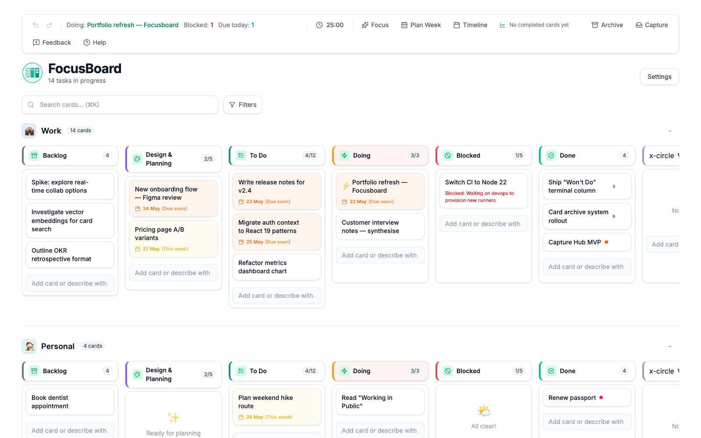
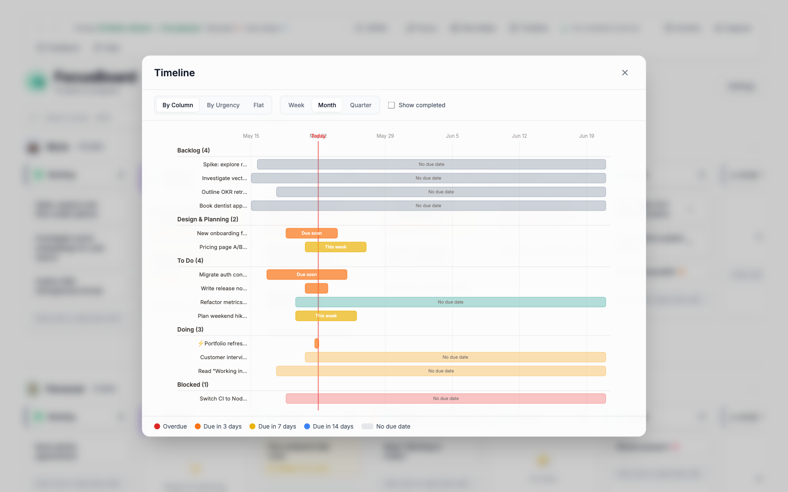
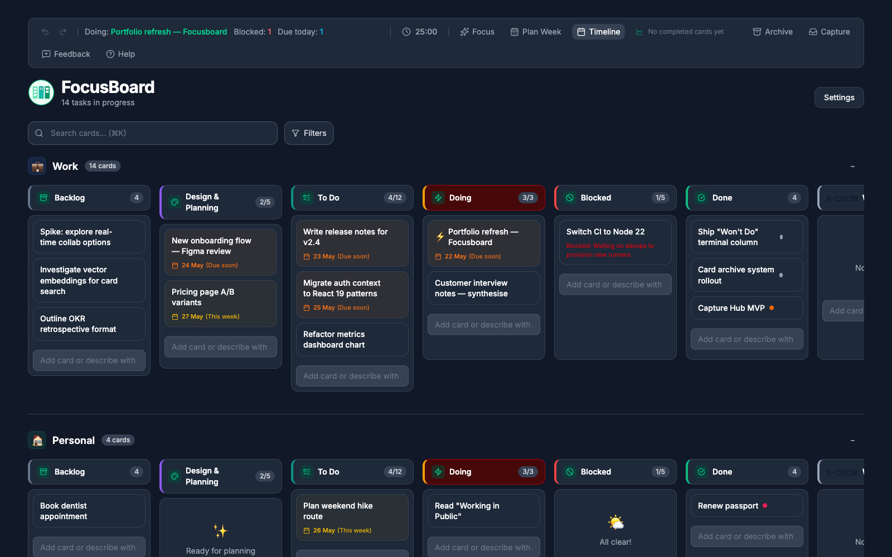

# Focusboard

[](https://focusboard-git-main-claire-donalds-projects.vercel.app/)
[](https://react.dev/)
[](https://www.typescriptlang.org/)
[](#testing)

A kanban board built for actually getting things done — not just tracking them. WIP limits enforce focus, swimlanes separate work from life, and an AI capture layer turns scattered inputs from Slack, email, and shortcuts into structured cards.



**[Try the live demo →](https://focusboard-git-main-claire-donalds-projects.vercel.app/)**

## Why this exists

Most kanban tools assume you have a team and a backlog. Focusboard assumes you have a working memory limit and twenty browser tabs of things you meant to do. It's built around three ideas:

1. **WIP limits aren't optional.** Each column caps active work — when you exceed it, the board warns you.
2. **Capture beats organisation.** Send tasks in from anywhere; let an LLM parse them; review what's uncertain in the inbox.
3. **The work itself is the source of truth.** Cycle time, lead time, and stale-backlog warnings come from card movement, not self-reported status.

## Highlights

### Focus mechanics
- WIP limits per column with visual warnings
- Smart urgency colouring (overdue → red, due soon → orange, this week → yellow)
- Stale backlog warnings for cards sitting without due dates
- Auto-priority that maps due-date proximity to priority tags
- Pomodoro timer with streak tracking
- Card archive + "Won't Do" terminal column for declined work

### Capture & AI
- **Capture Hub** — Slack reactions, forwarded emails, browser extension, iOS/Mac Shortcuts, or in-app `Cmd+Shift+C`. AI parses raw text into title, tags, and due date.
- **Natural-language cards** — type "urgent bug fix login page by friday" and the card is created with structure.
- **Daily Focus** — AI surfaces your top 3-5 tasks for the day.
- **Weekly Plan** — 7-day calendar view with AI scheduling suggestions.
- **Task breakdown** — AI generates subtasks for complex cards.

### Views
- Work/Personal swimlanes (collapsible, separately filtered)
- Timeline (Gantt-style) by column, urgency, or flat
- Metrics dashboard — completed cards, cycle time, WIP violations
- Filter bar — search, column, tag, due date, blocker status



### Quality of life
- Full undo/redo with keyboard shortcuts
- Drag-and-drop between columns and swimlanes
- Card relationships ("blocks", "blocked by", "related to")
- Light/dark/system theme
- Custom backgrounds (Unsplash picker or your own upload)
- Confetti on completion (optional)
- Keyboard-first navigation
- Webhook API for Apple Shortcuts, Zapier, etc.



## Tech stack

- **Frontend**: React 19, TypeScript, Vite, Tailwind CSS, [@dnd-kit](https://dndkit.com/)
- **Backend**: Vercel serverless functions, Supabase (Postgres + Auth + Storage)
- **AI**: Anthropic Claude (Haiku for parsing, Sonnet for planning)
- **Testing**: Vitest + React Testing Library (585 tests, 100% of touched modules)
- **Hosting**: Vercel

## Quick start

```bash
git clone https://github.com/cla1redonald/focusboard.git
cd focusboard
npm install
npm run dev
```

Open [http://localhost:5173](http://localhost:5173). Without Supabase env vars set, the board runs locally with `localStorage` persistence — no signup required.

### Optional: cloud sync + multi-user

1. Create a Supabase project at [supabase.com](https://supabase.com).
2. Copy `.env.example` to `.env.local` and fill in your `VITE_SUPABASE_URL` and `VITE_SUPABASE_ANON_KEY`.
3. Run the SQL setup from [docs/SUPABASE.md](docs/SUPABASE.md).
4. Enable Email auth in your Supabase project.

Each user gets their own private board with isolated data and RLS.

### Optional: AI features

Set `ANTHROPIC_API_KEY` in Vercel environment variables. The AI features degrade gracefully if the key isn't present.

## Webhook API

```bash
curl -X POST https://your-app.vercel.app/api/webhook/add-card \
  -H "Content-Type: application/json" \
  -d '{"title": "Buy coffee", "secret": "your-secret"}'
```

Full reference: [docs/API.md](docs/API.md).

## Keyboard shortcuts

| Shortcut | Action |
|----------|--------|
| `Cmd/Ctrl + K` | Open command palette |
| `Cmd/Ctrl + Z` / `Shift + Z` | Undo / Redo |
| `Cmd/Ctrl + Shift + C` | Quick capture |
| `Arrow keys` | Navigate between cards |
| `Enter` | Open selected card |
| `N` | Add new card to focused column |
| `D` | Mark focused card as Done |
| `?` | Show all shortcuts |

## Scripts

| Command | Description |
|---------|-------------|
| `npm run dev` | Start the Vite dev server |
| `npm run build` | Typecheck and build for production |
| `npm run typecheck` | TypeScript check across the project |
| `npm run lint` | ESLint |
| `npm run test:run` | Run the full test suite |
| `npm run test:coverage` | Run tests with coverage report |
| `npm run preview` | Preview the production build |

## Documentation

| Document | What it covers |
|----------|----------------|
| [ARCHITECTURE.md](ARCHITECTURE.md) | Data model, state machine, and architectural decisions |
| [TESTING.md](TESTING.md) | Testing strategy and patterns |
| [docs/API.md](docs/API.md) | Webhook, Capture Hub, and Feedback API reference |
| [docs/SUPABASE.md](docs/SUPABASE.md) | Database schema and RLS setup |

## License

MIT
